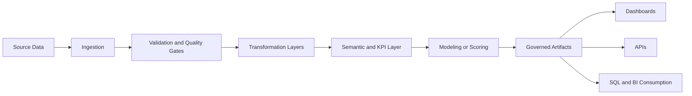
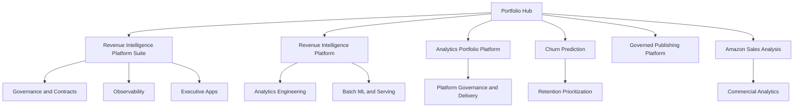
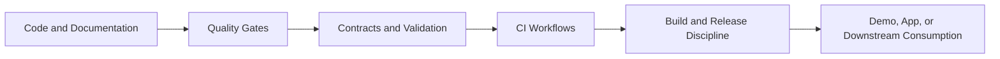
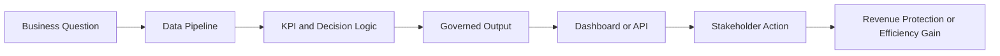

# Samuel Maia

**Premium portfolio for Analytics Engineering, revenue analytics, BI applications, and decision-ready data products**

[](https://www.linkedin.com/in/samuelmaia-analytics)
[](https://revenue-intelligence-platform.streamlit.app/)
[](https://revenue-intelligence-platform-suite.streamlit.app/)
[](./docs/architecture.md)

`Language:` **English** | [Português (Brasil)](./README.pt-BR.md)

## Executive Summary

I build analytics systems that help business teams trust data, act faster, and make better commercial decisions.
This portfolio is intentionally curated to reflect a level of analytical maturity aligned with production-minded analytics engineering, revenue analytics, data quality, BI applications, and business-facing analytical delivery.

The emphasis is not on project count.
It is on decision value, architectural clarity, governed outputs, and credible execution from ingestion to executive consumption.

This repository should be read as a premium portfolio hub and a working platform scaffold.
It combines flagship portfolio projects with a root-level enterprise-style analytics platform that demonstrates contracts, observability, semantic metrics, GenAI-assisted insight drafts, governance controls, and dbt-like analytics engineering structure.

## Value Proposition

For recruiters, this portfolio shows a strong combination of analytics engineering discipline and business framing.

For data leaders, it demonstrates how I structure analytical products with clear runtime ownership, reproducible outputs, contracts, observability, and downstream consumption paths.

For potential clients, it shows how data work can be translated into revenue protection, retention prioritization, KPI standardization, and stakeholder-ready applications instead of isolated notebooks or disconnected dashboards.

### Audience Lens

| Audience | What this repository shows |
|---|---|
| Recruiters | A portfolio with maturity aligned across analytics engineering, BI, governance, and business-facing delivery |
| Data leaders | A maintainable operating model with quality gates, contracts, semantic consistency, and delivery surfaces |
| Potential clients | How analytics work can become a decision product with measurable business relevance |

### Executive Signals

| Area | Signal |
|---|---|
| Business value | Revenue, retention, KPI standardization, and executive decision support |
| Architecture | Layered pipelines, contract-aware outputs, governed artifacts, reusable platform services |
| Quality | Automated tests, smoke checks, data validation, and policy checks |
| Delivery | Streamlit, FastAPI, SQLite warehouse, SQL, dbt-like models, CI workflows |
| Governance | Contracts, runtime config review, change-driver thresholds, observability, repository registry |

## Core Portfolio Assets

### Revenue Intelligence Platform Suite

Flagship portfolio proof for platform thinking, executive decision support, governance, observability, and integrated analytical modules.

- Focus: revenue performance, retention exposure, KPI visibility, action prioritization
- Signals: monorepo structure, shared contracts, executive app, release discipline
- Repository: https://github.com/samuelmaia-analytics/revenue-intelligence-platform-suite
- Demo: https://revenue-intelligence-platform-suite.streamlit.app/

### Revenue Intelligence Platform - End-to-End Analytics & ML System

The strongest standalone technical proof in the portfolio.
Shows a production-minded batch analytics system with governed outputs, warehouse artifacts, API delivery, dbt consumption, smoke-tested UI, and operational documentation.

- Focus: end-to-end analytics engineering, ML-assisted decision support, KPI modeling
- Signals: one official runtime path, contracts, runbook, Docker, SQL, dbt, CI matrix
- Repository: https://github.com/samuelmaia-analytics/Revenue-Intelligence-Platform-End-to-End-Analytics-ML-System
- Demo: https://revenue-intelligence-platform.streamlit.app/

### Analytics Portfolio Platform

This repository now works as a product-grade portfolio platform, not only as an index page.
It demonstrates an enterprise-style analytics scaffold with governed contracts, FastAPI and Streamlit delivery surfaces, semantic metrics, GenAI-assisted analytical drafts, observability, and a dbt-like analytics engineering layer.

- Focus: portfolio operating model, analytics platform architecture, governance, semantic consistency
- Signals: centralized config, runtime policy checks, SQLite warehouse, contracts, trend history, analytics-engineering validation
- Repository: https://github.com/samuelmaia-analytics/samuelmaia-analytics
- Entry points: `docs/architecture.md`, `docs/quickstart.md`, `dbt/README.md`

### Supporting Portfolio Assets

- `churn-prediction`: business-facing retention analytics with layered pipeline, dashboard, API path, and drift monitoring
- `SAMUEL_MAIA_DDF_TECH_032026`: governed analytical publication, semantic marts, operational monitoring, multi-surface analytical consumption
- `amazon-sales-analysis`: commercial analytics, discount leakage diagnostics, category prioritization, executive framing

## Enterprise Platform Scaffold

This repository now also includes a maintainable root-level platform scaffold designed around enterprise-style analytical product development.
It introduces a clear separation between `app`, `core`, `services`, `config`, `data`, `docs`, `assets`, and `tests`, plus a working base for FastAPI, Streamlit, data quality, semantic metrics, GenAI insights, observability, and CI/CD.

Start here:

- [Architecture](./docs/architecture.md)
- [Repository Structure](./docs/repository_structure.md)
- [Quickstart](./docs/quickstart.md)

## Technical Architecture

The portfolio is organized around analytical systems rather than isolated analyses.
Across the main repositories, the recurring operating model is:

```text
source data -> ingestion -> validation -> transformation -> semantic/KPI layer
-> modeling or scoring -> governed artifacts -> dashboard/API/SQL consumption
```



Core architectural patterns demonstrated across the portfolio:

- layered data flows such as `raw -> bronze -> silver -> gold`
- business logic separated from presentation surfaces
- dashboards that consume generated artifacts instead of becoming a second source of truth
- contract-aware outputs for reporting, processed exports, and downstream consumers
- local-first reproducibility with clear upgrade paths toward warehouse and enterprise connectors
- analytical products designed around business questions, not only technical implementation

### Portfolio Architecture



## Stack

Primary technologies used in this repository:

- Python
- SQL
- Streamlit
- FastAPI
- SQLite
- Pydantic
- jsonschema
- GitHub Actions
- pytest
- Ruff

Supporting portfolio technologies visible across selected repositories:

- dbt
- Docker
- scikit-learn
- MLflow
- Power BI
- Pandera
- Black, isort, mypy

### Delivery Footprint

- Presentation: Streamlit multipage application
- Service layer: FastAPI with protected endpoints
- Warehouse: SQLite-backed local analytical surface
- Transformation: SQL assets and dbt-like model structure
- Quality: schema tests, SQL tests, contracts, smoke tests, policy checks
- AI layer: provider-agnostic GenAI architecture with local fallback and OpenAI-compatible path

## Governance and Data Quality

Governance is a visible part of the portfolio because analytical trust matters as much as modeling accuracy.

Examples of governance and quality signals present across the main repositories:

- data contracts and schema validation
- explicit repository structures and ownership boundaries
- architecture decision records
- runbooks, troubleshooting guides, and release notes
- quality reports and governed processed artifacts
- compatibility and deprecation discipline where legacy paths exist
- issue templates, PR templates, CODEOWNERS, and contribution standards

### Analytics Engineering Signals

- `raw`, `staging`, `intermediate`, and `marts` layers under [`dbt/`](./dbt)
- source definitions, schema tests, SQL data tests, and metric layer
- business logic and lineage-oriented documentation
- local dbt-like validation runner over the SQLite warehouse
- semantic consistency between KPI definitions, marts, contracts, and downstream surfaces

## CI/CD

The strongest repositories go beyond basic unit tests.
They use CI/CD as evidence that the work is reproducible, reviewable, and operationally coherent.

Signals already demonstrated in the portfolio include:

- linting, formatting, type checking, and automated tests
- smoke testing for Streamlit apps and API surfaces
- build validation for packages and containers
- downstream SQL and dbt validation
- repository-governance and operational-asset checks
- release notes and publication workflows



## Proof of Execution

This portfolio is designed to show implemented capability, not only intended direction.

Execution evidence visible across the main repositories includes:

- live public demos
- generated artifacts and governed exports
- smoke-tested dashboards and APIs
- release notes tied to repository evolution
- repository structures that map documentation claims to code and tests

### Current Platform Capabilities

- executive dashboards and protected API endpoints
- change-driver monitoring with configurable materiality thresholds
- runtime configuration review and governance policy checks
- historical metric, domain, and project trend tracking
- GenAI-assisted drafts for KPI narrative, glossary, anomaly explanation, and executive summary
- dbt-like analytics engineering layer with documented model flow

## Operational Signals

Senior-level analytical work should be inspectable not only from the modeling layer, but from the operating layer.

Operational signals demonstrated across the portfolio include:

- canonical runtime paths
- documented environments and setup flows
- runbooks, troubleshooting guides, and incident-style documentation
- explicit quality gates and validation commands
- release and change discipline
- local-first reproducibility with enterprise-oriented upgrade paths

## How I Create Business Value

My work is designed to answer practical business questions such as:

- Where is revenue at risk and what should the business act on first?
- Which customers, channels, categories, or segments deserve prioritization?
- How should KPI logic remain stable across pipelines, dashboards, and executive reviews?
- How do governance, quality controls, and CI/CD improve confidence in analytical outputs?

Typical value delivered through these systems:

- revenue protection through prioritization logic
- retention visibility through customer risk segmentation
- faster decision cycles through artifact-backed dashboards and KPI layers
- improved analytical credibility through governed outputs and reproducible workflows
- cleaner stakeholder handoff through documentation, contracts, and operational assets



## Why This Portfolio Is Different

Most public data portfolios optimize for model variety or dashboard count.
This one is designed to show how analytical work behaves when treated like a real product surface.

What makes it different:

- stronger emphasis on business framing than on isolated technical tricks
- architectural consistency across projects
- governance and operating signals that are usually missing in portfolios
- analytical outputs tied to stakeholder decisions
- a clear bridge between analytics engineering, BI, data quality, and product thinking
- a visible platform scaffold that makes the operating model inspectable at repository level

## Portfolio Structure

This GitHub is intentionally organized by priority, not by project count.

### Flagship

- `revenue-intelligence-platform-suite`

### Core Proofs

- `Revenue-Intelligence-Platform-End-to-End-Analytics-ML-System`
- `samuelmaia-analytics`
- `churn-prediction`
- `SAMUEL_MAIA_DDF_TECH_032026`
- `amazon-sales-analysis`

### Supporting Depth

- `data-senior-analytics`
- `analise-vendas-python`

Recommended supporting documents:

- [Project Index](./docs/project_index.md)
- [Portfolio Strategy](./docs/portfolio_strategy.md)
- [GitHub Positioning](./docs/github_positioning.md)
- [GitHub Execution Pack](./docs/github_execution_pack.md)

## Roadmap

Current portfolio modernization priorities:

1. Keep strengthening the flagship and core repositories as the primary hiring surface.
2. Reduce narrative noise and keep only repositories that reinforce the same maturity thesis.
3. Continue improving release evidence, operational proofs, and downstream validation depth.
4. Increase enterprise readiness signals where they remain local-first today.
5. Keep English-first documentation and recruiter-facing positioning consistently polished.

## For Recruiters

If you are hiring for Analytics Engineer, Senior Data Analyst, Revenue Analytics, BI, or business-facing data product roles, start here:

1. `revenue-intelligence-platform-suite` for platform thinking and executive-facing delivery
2. `Revenue-Intelligence-Platform-End-to-End-Analytics-ML-System` for the strongest standalone engineering proof
3. `samuelmaia-analytics` for platform scaffold, governance, and analytics engineering operating model

What you should expect to find quickly:

- clear business context
- layered architecture
- governed outputs
- tested analytical applications
- documentation that explains both implementation and operating model

## Links

- GitHub: https://github.com/samuelmaia-analytics
- LinkedIn: https://www.linkedin.com/in/samuelmaia-analytics
- Revenue Intelligence Platform Demo: https://revenue-intelligence-platform.streamlit.app/
- Revenue Intelligence Platform Suite Demo: https://revenue-intelligence-platform-suite.streamlit.app/
- Churn Prediction Demo: https://telecom-churn-prediction-samuelmaiapro.streamlit.app/
- Portfolio Demo: https://samuelmaia-032026.streamlit.app/

## Contact

If you are evaluating candidates or partners for analytics engineering, business-facing analytics, revenue analytics, or data product delivery, this repository is the best entry point into the portfolio.
