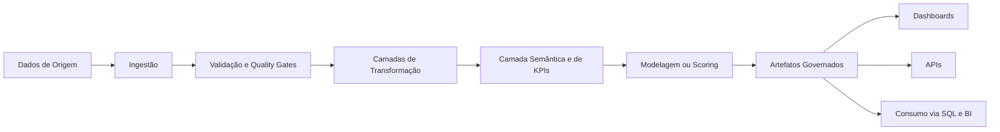
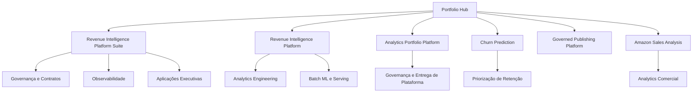
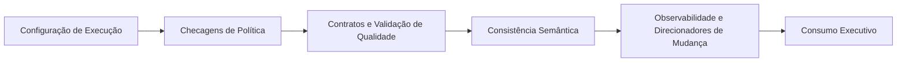
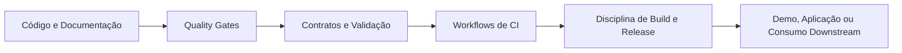
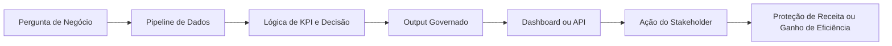

# Samuel Maia

**Portfólio premium de engenharia analítica, analytics de receita, aplicações de BI e produtos de dados orientados à decisão**

[](https://www.linkedin.com/in/samuelmaia-analytics)
[](https://revenue-intelligence-platform.streamlit.app/)
[](https://revenue-intelligence-platform-suite.streamlit.app/)
[](./docs/architecture.md)

`Idioma:` [English](./README.md) | **Português (Brasil)**

## Resumo Executivo

Eu construo sistemas analíticos que ajudam áreas de negócio a confiar nos dados, agir com mais velocidade e tomar decisões comerciais melhores.
Este portfólio foi intencionalmente curado em torno de engenharia analítica orientada a produção, analytics de receita, qualidade de dados, aplicações de BI e entrega analítica voltada ao negócio.

O foco não está em quantidade de projetos.
Está em valor para decisão, clareza arquitetural, outputs governados e execução crível do dado bruto ao consumo executivo.

Este repositório deve ser lido como hub premium de portfólio e também como uma base funcional de plataforma.
Ele combina projetos principais com uma estrutura raiz em padrão corporativo que demonstra contratos, observabilidade, métricas semânticas, rascunhos assistidos por GenAI, controles de governança e uma camada de engenharia analítica inspirada em dbt.

O sinal mais forte aqui não é amplitude.
É o fato de que o modelo operacional está visível: caminhos de runtime, contratos, testes, disciplina de release, checagens de qualidade e superfícies executivas de consumo podem ser inspecionados em código e documentação.

### Visão Executiva

| Sinal | Evidência |
|---|---|
| Valor de negócio | Receita, retenção, padronização de KPIs e produtos analíticos orientados à decisão |
| Arquitetura | Pipelines em camadas, artefatos governados, superfícies de API e aplicação |
| Qualidade | Contratos, validação, smoke tests, workflows de CI e checagens de política |
| Analytics engineering | Camadas em estilo dbt, consistência semântica, lógica de métricas e exports de warehouse |
| Modelo operacional | Runbooks, caminhos reproduzíveis de runtime, observabilidade e disciplina de release |

## Proposta de Valor

Para recrutadores, este portfólio mostra uma combinação forte entre disciplina de engenharia analítica e enquadramento de negócio.

Para líderes de dados, ele demonstra como estruturo produtos analíticos com responsabilidade clara de execução, saídas reproduzíveis, contratos, observabilidade e caminhos downstream de consumo.

Para potenciais clientes, ele mostra como trabalho de dados pode ser traduzido em proteção de receita, priorização de retenção, padronização de KPIs e aplicações voltadas para stakeholders, em vez de notebooks isolados ou dashboards desconectados.

### Leitura por Público

| Público | O que este repositório demonstra |
|---|---|
| Recrutadores | Um portfólio com maturidade equiparada em engenharia analítica, BI, governança e entrega orientada ao negócio |
| Líderes de dados | Um modelo operacional sustentável com controles de qualidade, contratos, consistência semântica e superfícies de entrega |
| Potenciais clientes | Como trabalho analítico pode virar produto de decisão com relevância clara de negócio |

### Sinais Executivos

| Área | Sinal |
|---|---|
| Valor de negócio | Receita, retenção, padronização de KPIs e suporte executivo à decisão |
| Arquitetura | Pipelines em camadas, outputs com contratos, artefatos governados, serviços reutilizáveis |
| Qualidade | Testes automatizados, verificações rápidas, validação de dados e checagens de política |
| Entrega | Streamlit, FastAPI, warehouse em SQLite, SQL, modelos em estilo dbt e workflows de CI |
| Governança | Contratos, revisão de configuração de execução, thresholds de materialidade, observabilidade e registro de repositórios |

## Projetos em Destaque

### Revenue Intelligence Platform Suite

Principal prova de portfólio para visão de plataforma, suporte executivo à decisão, governança, observabilidade e integração de módulos analíticos.

- Foco: performance de receita, exposição de retenção, visibilidade de KPIs, priorização de ações
- Sinais: estrutura monorepo, contratos compartilhados, aplicação executiva, disciplina de release
- Repositório: https://github.com/samuelmaia-analytics/revenue-intelligence-platform-suite
- Demo: https://revenue-intelligence-platform-suite.streamlit.app/

### Revenue Intelligence Platform - End-to-End Analytics & ML System

É a prova técnica standalone mais forte do portfólio.
Mostra um sistema batch orientado a produção com outputs governados, artefatos de warehouse, entrega via API, consumo por dbt, UI com smoke tests e documentação operacional.

- Foco: engenharia analítica de ponta a ponta, suporte à decisão com ML, modelagem de KPIs
- Sinais: um runtime oficial, contratos, runbook, Docker, SQL, dbt, matriz de CI
- Repositório: https://github.com/samuelmaia-analytics/Revenue-Intelligence-Platform-End-to-End-Analytics-ML-System
- Demo: https://revenue-intelligence-platform.streamlit.app/

### Analytics Portfolio Platform

Este repositório agora funciona como uma plataforma de portfólio com padrão de produto, não apenas como página de índice.
Ele demonstra uma base analítica em estilo corporativo com contratos governados, superfícies de entrega em FastAPI e Streamlit, métricas semânticas, rascunhos analíticos com GenAI, observabilidade e uma camada de analytics engineering em estilo dbt.

- Foco: modelo operacional do portfólio, arquitetura de plataforma analítica, governança, consistência semântica
- Sinais: configuração centralizada, checagens de política de runtime, warehouse em SQLite, contratos, histórico de tendência, validação de analytics engineering
- Repositório: https://github.com/samuelmaia-analytics/samuelmaia-analytics
- Pontos de entrada: `docs/architecture.md`, `docs/quickstart.md`, `dbt/README.md`

### Ativos Complementares do Portfólio

- `churn-prediction`: analytics de retenção orientado ao negócio, com pipeline em camadas, dashboard, superfície de API e monitoramento de drift
- `SAMUEL_MAIA_DDF_TECH_032026`: publicação analítica governada, marts semânticos, monitoramento operacional, consumo analítico multi-superfície
- `amazon-sales-analysis`: analytics comercial, diagnóstico de vazamento de desconto, priorização por categoria, enquadramento executivo

## Enterprise Platform Scaffold

Este repositório agora também inclui uma base estruturada na raiz, voltada ao desenvolvimento de produtos analíticos em padrão corporativo.
Ela introduz uma separação clara entre `app`, `core`, `services`, `config`, `data`, `docs`, `assets` e `tests`, além de uma base funcional para FastAPI, Streamlit, qualidade de dados, métricas semânticas, insights com GenAI, observabilidade e CI/CD.

Comece por aqui:

- [Architecture](./docs/architecture.md)
- [Repository Structure](./docs/repository_structure.md)
- [Quickstart](./docs/quickstart.md)

## Arquitetura Técnica

O portfólio é organizado em torno de sistemas analíticos, não de análises isoladas.
Nos principais repositórios, o modelo operacional recorrente é:

```text
dados de origem -> ingestão -> validação -> transformação -> camada semântica/de KPIs
-> modelagem ou scoring -> artefatos governados -> consumo via dashboard/API/SQL
```



Padrões arquiteturais centrais demonstrados no portfólio:

- fluxos em camadas como `raw -> bronze -> silver -> gold`
- lógica de negócio separada das camadas de apresentação
- dashboards que consomem artefatos gerados em vez de virarem uma segunda fonte de verdade
- saídas com contratos para reporte, exportações processadas e consumidores downstream
- reprodutibilidade local-first com caminho claro para conectores corporativos e warehouse
- produtos analíticos desenhados em torno de perguntas de negócio, não só de implementação técnica

### Arquitetura do Portfólio



## Stack

Tecnologias principais utilizadas neste repositório:

- Python
- SQL
- Streamlit
- FastAPI
- SQLite
- Pydantic
- jsonschema
- GitHub Actions
- pytest
- Ruff

Tecnologias complementares visíveis em repositórios selecionados do portfólio:

- dbt
- Docker
- scikit-learn
- MLflow
- Power BI
- Pandera
- Black, isort, mypy

### Estrutura de Entrega

- Apresentação: aplicação Streamlit multipage
- Camada de serviços: FastAPI com endpoints protegidos
- Warehouse: superfície analítica local baseada em SQLite
- Transformação: ativos SQL e estrutura de modelos dbt-like
- Qualidade: testes de esquema, testes SQL, contratos, verificações rápidas e checagens de política
- Camada de IA: arquitetura GenAI desacoplada com fallback local e caminho compatível com OpenAI

## Governança e Qualidade de Dados

Governança é uma parte visível do portfólio porque confiança analítica importa tanto quanto acurácia de modelo.



Exemplos de sinais de governança e qualidade presentes nos principais repositórios:

- contratos de dados e validação de esquema
- estruturas explícitas de repositório e limites claros de responsabilidade
- registros de decisão arquitetural
- runbooks, guias de troubleshooting e release notes
- relatórios de qualidade e artefatos processados governados
- disciplina de compatibilidade e depreciação quando existem caminhos legados
- issue templates, PR templates, CODEOWNERS e padrões de contribuição

### Sinais de Analytics Engineering

- camadas `raw`, `staging`, `intermediate` e `marts` sob [`dbt/`](./dbt)
- definições de fontes, testes de esquema, testes SQL e camada de métricas
- documentação de lógica de negócio e lineage orientada a consumo
- runner local dbt-like sobre o SQLite warehouse
- consistência semântica entre KPIs, marts, contratos e superfícies downstream

## CI/CD

Os repositórios mais fortes vão além de testes unitários básicos.
Eles usam CI/CD como evidência de que o trabalho é reproduzível, auditável e operacionalmente coerente.

Sinais já demonstrados no portfólio:

- lint, formatação, checagem de tipos e testes automatizados
- smoke tests para aplicações Streamlit e superfícies de API
- validação de build para pacotes e containers
- validação downstream de SQL e da camada em estilo dbt
- checagens de governança de repositório e ativos operacionais
- workflows de release notes e publicação



## Prova de Execução

Este portfólio foi desenhado para mostrar capacidade implementada, não apenas direção pretendida.

Evidências de execução visíveis nos principais repositórios incluem:

- demos públicas em produção
- artefatos gerados e exports governados
- dashboards e APIs com smoke tests
- release notes ligadas à evolução dos repositórios
- estruturas de repositório que conectam claims documentais a código e testes

### Checklist de Revisão

| O que um revisor normalmente pergunta | Onde a evidência aparece |
|---|---|
| Existe um caminho canônico de runtime? | repositórios principais, runbooks, caminhos de CLI e `core/pipeline.py` na raiz |
| Os outputs são governados? | contratos, validação de esquema, relatórios de qualidade e artefatos processados |
| A entrega é testável? | workflows de CI, smoke tests, checagens de API e scripts de validação da aplicação |
| A lógica de negócio está separada da apresentação? | arquitetura em camadas, aplicações baseadas em artefatos, camada semântica e exports de warehouse |
| Isso se sustenta além de uma demo? | documentação, checagens de política, release notes, estrutura do repositório e reprodutibilidade local |

### Capacidades Atuais da Plataforma

- dashboards executivos e endpoints protegidos de API
- monitoramento de direcionadores de mudança com thresholds configuráveis
- revisão de configuração de execução e checagens de política de governança
- tracking histórico de tendência por métrica, domínio e projeto
- rascunhos assistidos por GenAI para narrativa de KPIs, glossário, explicação de anomalias e resumo executivo
- camada analytics engineering dbt-like com fluxo de modelos documentado

## Sinais Operacionais

Trabalho analítico em alto nível de maturidade deve ser inspecionável não apenas na camada de modelagem, mas também na camada operacional.

Sinais operacionais demonstrados ao longo do portfólio incluem:

- caminhos canônicos de runtime
- ambientes documentados e fluxos claros de setup
- runbooks, guias de troubleshooting e documentação no estilo incident
- controles de qualidade explícitos e comandos de validação
- disciplina de release e de mudança
- reprodutibilidade local-first com caminhos de evolução voltados a contexto enterprise

### O Que Isso Significa Na Revisão

- revisores conseguem rastrear como o dado vira output sem depender do estado de notebooks
- líderes conseguem ver onde governança e controles de entrega ficam no modelo operacional
- clientes conseguem entender como a lógica analítica vira uma superfície de decisão, não apenas uma análise isolada

## Como Eu Gero Valor de Negócio

Meu trabalho é desenhado para responder perguntas práticas como:

- Onde a receita está em risco e em que o negócio deve agir primeiro?
- Quais clientes, canais, categorias ou segmentos merecem priorização?
- Como a lógica de KPIs deve permanecer estável entre pipelines, dashboards e revisões executivas?
- Como governança, controles de qualidade e CI/CD aumentam a confiança nos outputs analíticos?

Valor tipicamente entregue por esses sistemas:

- proteção de receita por meio de lógica de priorização
- visibilidade de retenção por segmentação de risco de clientes
- ciclos de decisão mais rápidos com dashboards baseados em artefatos e camadas de KPI
- maior credibilidade analítica com outputs governados e workflows reproduzíveis
- transição mais limpa para stakeholders com documentação, contratos e ativos operacionais



## Por Que Este Portfólio É Diferente

A maior parte dos portfólios públicos de dados otimiza por variedade de modelos ou quantidade de dashboards.
Este foi construído para mostrar como trabalho analítico se comporta quando tratado como uma superfície real de produto.

O que o diferencia:

- ênfase maior em enquadramento de negócio do que em truques técnicos isolados
- consistência arquitetural entre projetos
- sinais de governança e operação que normalmente não aparecem em portfólios
- outputs analíticos ligados a decisões de stakeholders
- ponte clara entre engenharia analítica, BI, qualidade de dados e visão de produto
- uma base de plataforma visível que torna o modelo operacional inspecionável no próprio repositório

## Estrutura do Portfólio

Este GitHub é intencionalmente organizado por prioridade, não por quantidade de projetos.

### Flagship

- `revenue-intelligence-platform-suite`

### Provas Centrais

- `Revenue-Intelligence-Platform-End-to-End-Analytics-ML-System`
- `samuelmaia-analytics`
- `churn-prediction`
- `SAMUEL_MAIA_DDF_TECH_032026`
- `amazon-sales-analysis`

### Profundidade de Apoio

- `data-senior-analytics`
- `analise-vendas-python`

Documentos complementares recomendados:

- [Project Index](./docs/project_index.md)
- [Portfolio Strategy](./docs/portfolio_strategy.md)
- [GitHub Positioning](./docs/github_positioning.md)
- [GitHub Execution Pack](./docs/github_execution_pack.md)

## Roadmap

Prioridades atuais de modernização do portfólio:

1. Continuar fortalecendo os repositórios principais como superfície prioritária para avaliação.
2. Reduzir ruído narrativo e manter visíveis apenas os repositórios que reforçam a mesma tese de maturidade.
3. Continuar aprofundando evidências de release, provas operacionais e validação downstream.
4. Aumentar sinais de prontidão corporativa onde hoje a abordagem ainda é local-first.
5. Manter a documentação em inglês como padrão principal, com posicionamento para recrutadores sempre polido.

## Para Recrutadores

Se você está contratando para Analytics Engineer, Senior Data Analyst, Revenue Analytics, BI ou papéis ligados a produtos de dados orientados ao negócio, comece por aqui:

1. `revenue-intelligence-platform-suite` para visão de plataforma e entrega executiva
2. `Revenue-Intelligence-Platform-End-to-End-Analytics-ML-System` para a prova standalone mais forte de engenharia
3. `samuelmaia-analytics` para base de plataforma, governança e modelo operacional de analytics engineering

O que você deve conseguir encontrar rapidamente:

- contexto de negócio claro
- arquitetura em camadas
- outputs governados
- aplicações analíticas testadas
- documentação que explica tanto a implementação quanto o modelo operacional

O que este portfólio foi otimizado para demonstrar:

- julgamento de analytics engineering, não apenas velocidade de implementação
- entrega voltada ao negócio, não apenas correção técnica
- manutenibilidade, governança e capacidade de revisão dentro de um escopo realista

## Links

- GitHub: https://github.com/samuelmaia-analytics
- LinkedIn: https://www.linkedin.com/in/samuelmaia-analytics
- Revenue Intelligence Platform Demo: https://revenue-intelligence-platform.streamlit.app/
- Revenue Intelligence Platform Suite Demo: https://revenue-intelligence-platform-suite.streamlit.app/
- Churn Prediction Demo: https://telecom-churn-prediction-samuelmaiapro.streamlit.app/
- Portfolio Demo: https://samuelmaia-032026.streamlit.app/

## Contato

Se você está avaliando candidatos ou parceiros para engenharia analítica, analytics orientado ao negócio, analytics de receita ou entrega de produtos de dados, este repositório é o melhor ponto de entrada para o portfólio.
